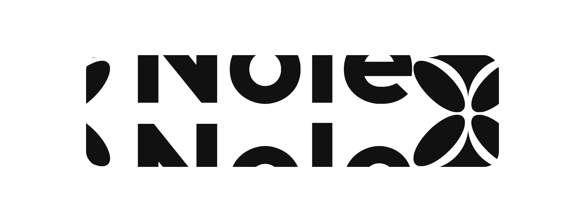

<p align="center">
  
</p>

## Overview

This project introduces a decentralized NFT collection registry and minting system built on the Nil Foundation network. It enables users to deploy their own NFT collections and mint NFTs seamlessly. The architecture consists of a `CollectionRegistry`, `Collection` contracts, and `NFT` tokens.

## Features

🏗 Collection Factory: Deploy custom NFT collections dynamically.

🔍 Collection Discovery: Easily retrieve collections owned by a specific address.

🎨 NFT Minting: Mint unique NFTs within a collection.

📜 On-Chain Metadata: NFTs store metadata, including URIs, securely on-chain.

🔄 Nil Token Compatibility: Integrated with Nil’s token system for efficient transactions.

## Smart Contracts
### 1️⃣ CollectionRegistry – The Factory 🔨

The `CollectionRegistry` contract acts as a factory for NFT collections. Users can create collections and track their owned collections.

#### Functions:
- `createCollection(_name, _symbol, _contractURI)`: Deploys a new `Collection` contract.
- `getCollectionsOf(owner)`: Fetches all collections owned by a given address.
- `getCollectionsAmountOf(owner)`: Retrieves the number of collections a user owns.

### 2️⃣ Collection – The NFT Collection 📦
Each Collection contract represents a separate NFT collection, allowing the owner to mint NFTs.

#### Key Features:
- Collection Metadata: Name, Symbol, and Contract URI.
- Minting Mechanism: The owner can mint NFTs.
- Ownership Tracking: Keeps record of token holders.

#### Functions:

- `mint(_to, _tokenId, _tokenURI)`: Mints a new NFT to a specific address.
- `ownerOf(_tokenId)`: Retrieves the owner of a specific token.
- `tokenURI(_tokenId)`: Returns the metadata URI of a token.

### 3️⃣ NFT – The Tokenized Asset 🎭

Each NFT is implemented using Nil’s token system, inheriting `NilTokenBase` for efficient transactions.

#### Features:

- Integrated with Nil’s Token System
- Supports ERC165 Interface Detection

#### Functions:
- `tokenURI()`: Returns the token metadata URI.
- `collectionAddress()`: Retrieves the parent collection address.
- `supportsInterface(interfaceId)`: Confirms compliance with INFT & IERC165.

## What is next

### NFT transfer

Not supported yet.

### NFT Marketplace

A `Marketplace.sol` for trading NFTs will be introduced in future updates. It will enable users to list NFTs for sale, securely process transactions, and manage balances using Nil’s token system. The marketplace will support native and custom tokens for payments, virtual balance tracking, and asynchronous order handling.

## Development

1. Install dependencies

```sh
pnpm install
```

2. Deploy `CollectionRegistry.sol`

3. Set environment variables

- For contracts, example [`packages/contracts/.env.example`](packages/contracts/.env.example)
- For next.js, example [`packages/web/.env.example`](packages/web/.env.example)

```
SMART_ACCOUNT=0x00018b...
PRIVATE_KEY=d82a663...
NEXT_PUBLIC_RPC=https://api.devnet.nil.foundation/api/...

# CollectionRegistry address:
NEXT_PUBLIC_REGISTRY_ADDRESS=0x0001e21d49a7b23ae4c74fb2cfb73300340f6ff2

# Pinata – get your Pinata secrets on https://pinata.cloud/
PINATA_JWT=
NEXT_PUBLIC_GATEWAY_URL=
```
4. Compile contracts

```sh
pnpm compile:contracts
```

5. Run next.js app

```sh
pnpm dev:web
```